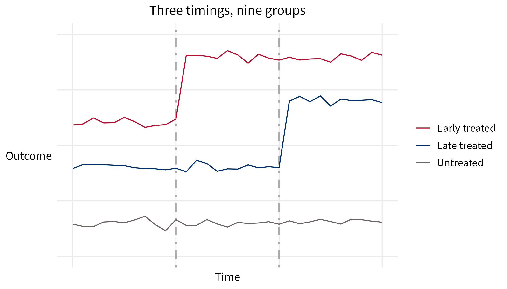
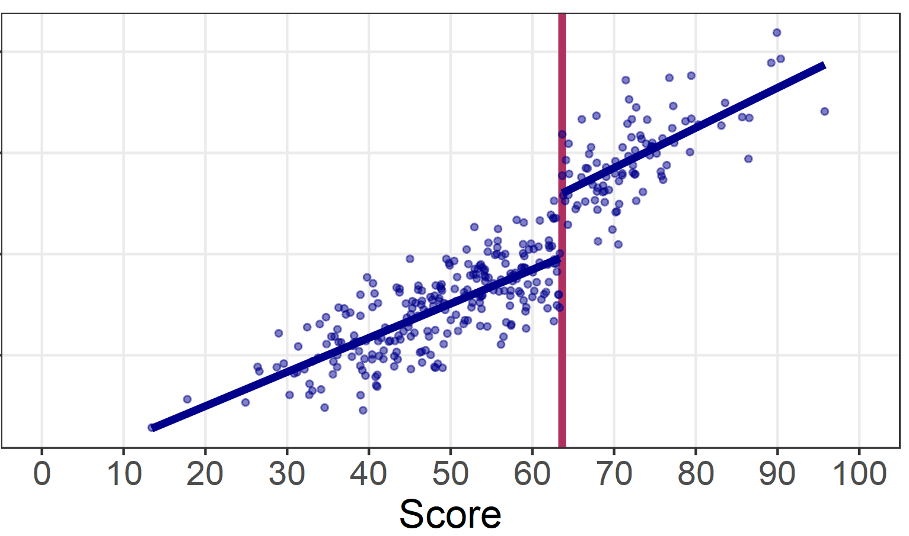
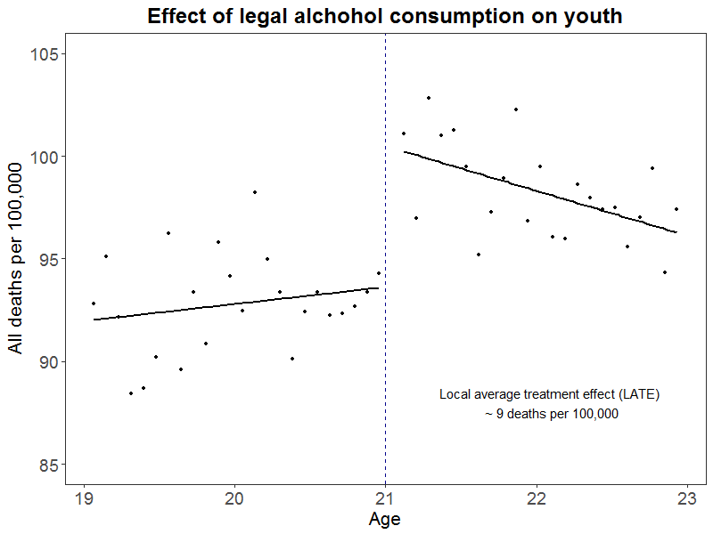
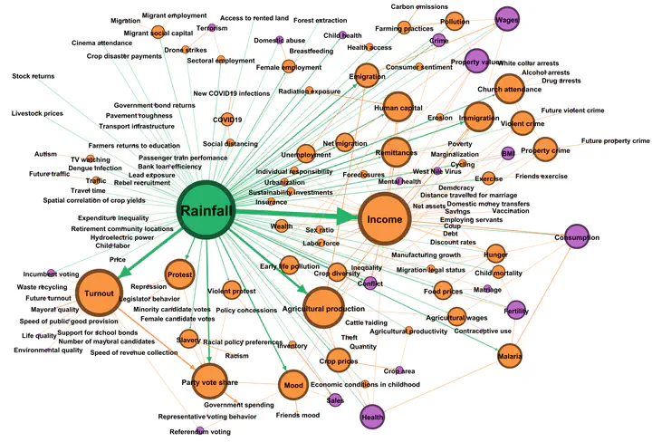

```{r setup, include=FALSE, message=F, warning=F}

knitr::opts_chunk$set(echo=F, message=F, warning=F, fig.height=10, fig.width=6)

library(here)
library(knitr)

source("../../../Methods Corner/misc/prep.r")

```

### Objectives of impact evaluation sessions

-   Understand the need for impact estimation of USAID activities
-   Understand how impact estimation fits into the Agency performance management framework
-   Gain practical knowledge about impact evaluation to help USAID staff better manage and support IEs

### Benchmarks for success

By the end of this session, participants will be able to:

-   Understand selection bias as a fundamental difficulty in identifying a valid counterfactual

-   Identify strategies for generating 'as-if' randomization

-   Understand the relative strengths and weaknesses of different designs

### [Level Set]{style="color:white;"} {background-color="#002F6C"}

### Measuring social benefit

We want to know the causal effect of an activity on its beneficiaries

-   Job training on earnings and employment

-   Teacher qualifications on student outcomes

-   Humanitarian assistance on food security

### Identifying a treatment assignment

-   We established indicators for treatment assignment $D_i$ and an outcome of interest $Y_i$

-   We established the switching equation $Y_i=D_iY_i^1+(1-D_i)Y_i^0$ mapping a potential treatment assignment to a realized outcome

-   We re-wrote the switching equation to $Y_i=Y_i^0+(Y_i^1-Y_i^0)D_i$ in order to highlight the individual treatment effect term $\delta_i=Y_i^1-Y_i^0$

### Decomposing the difference in means

We decomposed the difference in means into the average treatment effect and selection bias

$E\bigr[Y^1|D=1\bigr]-E\bigr[Y^0|D=0\bigr]$\
Average Treatment Effect on the Treated (ATT)\   
<center>+</center>  
$E\bigr[Y^0|D=1\bigr]-E\bigr[Y^0|D=0\bigr]$\
Difference between treatment and control group, before treatment (Selection bias)

### Dealing with selection bias 

- We established that the intervention could not be randomly assigned

- Without randomization, we don't have assurance that the selection bias term is zero! 

- What else could we do to make the selection bias term zero ? 

### Approximating as-if randomization

-   Adjust for confounders

-   Use trends over time to remove bias

-   Utilize an intervention's scoring system

-   Use features of the natural world 

### Adjusting for confounders

- Let's say we knew that we have non-random assignment of treatment, but we measured EXACTLY what determines treatment (variables X)

- If we match on / control for X then we would achieve independence between the assignment of treatment and the outcome

- This is called unconfoundedness

$D\perp Y |X$

### Adjusting for confounders

- What if we know some variables determine treatment, but we haven't measured them?

- What if there were variables that determine treatment that we aren't aware of? 

- These are unobserved confounders, and there's nothing we can do about it

### Selection on observables

- We can adjust for observed variables that help determine treatment
- We could theorize about the variables affecting treatment that are unobserved
- We can't do anything about variables affecting treatment that we don't know about

### Selection on observables

- This highlights the fundamental weakness of adjusting for confounders
- We can control for what we know about and have observed, but there may be other variables we haven't observed
- Regression adjustment / matching is often not a convincing strategy for causal inference

### Using trends over time (d-i-d)

- If we have a d-i-d setup WITHOUT randomization, we can use the trend in each group to estimate the counterfactual for the other group

- This only works if we know the pre-treatment trends are the same (parallel) across both groups!

- This is called the parallel trends assumption

### Parallel trends assumption

- The researcher MUST demonstrate parallel trends, or provide a compelling case for why they believe this assumption holds

```{r}


```


### Using trends over time

-   Recall that we can't go back in time, and we don't have access to alternate universes

- What if, instead of going back in time, we looked to the past? 

- The interrupted time series (ITS) design becomes possible when you have multiple measurements before and after treatment (more is better)

### Interrupted times series 

- Interrupted times series allows a within-comparison (itself) and avoids a between-comparison (something else)

```{r}
include_graphics("interrupted time series no title.png")

```
### Interrupted Time Series

- Interrupted time series is especially applicable when you have abundant data but entire systems or populations are treated

- Because ITS looks at a longer historical period, there may be other historical trends affecting your data

- The historical trend could be within your own treated units (maturation)

### Using an intervention's scoring system

- Recall that regression adjustment / matching balances observed characteristics across treatment and control groups

- What if there were a variable that divided treatment from the controls around an arbitrary cut-off?

- This is the regression discontinuity (RD) design

### Regression Discontinuity

- The most common application of the RD design is when there is a score to determine treatment

```{r}


```
### Real-world RD

RD applies in any situation where there is a running (score) variable with an arbitrary cutoff that creates 'as-if' randomization



```{r}
#

```


### RD strengths and limitations

For a valid RD design: 

- The cutoff score must be arbitrary

- The score must COMPLETELY determine treatment

- The score cannot be manipulated 

### Using features of the natural world

- What if we could find some real-world process that behaved randomly with respect to what you are studying? 

- We could look at how our outcome responds to treatment, where treatment is ONLY applied based on the real-world random process

- This is instrumental variable estimation

### Watch your instruments 

- The instrument must affect your outcome ONLY through its effect on treatment (exclusion restriction)

- Is rainfall a random process with regard to development interventions? 
  - In many cases, possibly yes
  
- But rainfall has now been used as an instrument to generate treatment effect estimates across hundreds of studies

### Violating the exclusion restriction 

- 294 studies using rainfall instrument, 194 possible exclusion restrictions!



### Ramadan, economic activity, and happiness

Surah Al-Baqarah (2:183-185):

"O you who have believed, decreed upon you is fasting as it was decreed upon those before you that you may become righteous" 

"So whoever sights the new moon of the month, let him fast it"

### Is the lunar calendar a valid instrument?

- The lunar calendar moves Ramadan 11 days per year

- This also affects the number of hours of fasting per day

- Cross-reference fasting hours per day with economic activity or subjective well-being

- Exclusion restriction: Does the moon affect economic activity or subjective well-being in any other ways?

### Review

- We have reviewed evaluation designs that seek to generate 'as-if' randomization

- This 'as-if' randomization must eliminate selection bias

- Experimental designs: $D\perp Y$

- Quasi-experimental designs: $D\perp Y|X$

### What are the strengths and limitations? 

- Regression adjustment / matching

- Difference-in-differences

- Interrupted time series

- Regression discontinuity

- Instrumental variables

### Quasi-experimental evaluation designs

- Researchers must fully engage with the limitations of their design, and address how they mitigated threats to validity

- Stay tuned for a deeper dive on matching, and a case study on the use of advanced d-i-d methods in a real-world evaluation

Thank you! 

